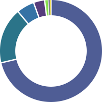

# kirby3-charts

A Kirby v3 plugin for creating SVG charts - batteries included.


## What

`kirby3-charts` is a Kirby v3 wrapper for [`SVGGraph`](https://github.com/goat1000/SVGGraph), as such there are (almost) no limits to what kind of chart may be created.


## How

Install this package with [Composer](https://getcomposer.org):

```text
composer require fundevogel/kirby3-charts
```


### Usage

In order to generate a chart, we need some data first. The page method `toChart()` accepts an array of data points as first argument - basically two or more arrays, each of which consists of `color` (string) and `share` (float):

```php
$data = [
    ['title' => 'HTML', 'color' => '#4F5D95', 'share' => 0.6],
    ['title' => 'CSS', 'color' => '#2b7489', 'share' => 0.4],
];

$page->toChart($data);
```

There's also a field method `toChart()` suitable for structure fields. The included example blueprint `fields/chart` is a good starting point & looks basically like this:

```yaml
type: structure
fields:
  title:
    label: Title
    type: text

  share:
    label: share
    type: number
    step: .01

  color:
    label: Color
    type: text
```

Both methods take another two arrays for further customization:

```php
# SVG settings
$settings = [
    'width' => 100,
    'height' => 100,
    'type' => 'DonutGraph',
    'inline' => false,
];

# Options depend on the type of chart (in this example 'DonutGraph'),
# see https://www.goat1000.com/svggraph.php
$options = [
    'inner_radius' => 2,
    'stroke_width' => 0.5,
    'show_labels' => true,

    # .. etc
];

# Page method
$page->toChart($data, $settings, $options);

# Field method
$page->chartData()->toChart($settings, $options);
```

**Note**: Both methods return a file object of the newly created SVG chart (unless `inline` is activated) for further use.


### Configuration

You may also change certain fallback options from your `config.php` globally (`'fundevogel.charts.optionName'`):

| Option        | Type   | Default      | Description                        |
| ------------- | ------ | ------------ | ---------------------------------- |
| `'type'`      | string | `DonutGraph` | Default chart type to be created   |
| `'template'`  | string | `chart`      | Default file template              |
| `'width'`     | int    | `100`        | SVG canvas width                   |
| `'height'`    | int    | `100`        | SVG canvas height                  |
| `'precision'` | int    | `2`          | Rounding precision (`-1` = off)    |
| `'inline'`    | bool   | `false`      | Return SVG string insead of `File` |


### Example

```php
# Create SVG chart as page file
$chart = $page->toChart($data, ['type' => 'DonutGraph'], [
    'donut_slice_gap' => 1.5,
    'inner_radius' => 0.7,
    'start_angle'  => -90,
    'stroke_width' => 0,
]);
```

Adding more items to the example `$data` from before and using above code, the generated chart looks like this:




## Roadmap

- [ ] Add tests


## Credits

This library is powered by `SVGGraph`, an extensive library for creating SVG charts, written by [goat1000](https://www.goat1000.com).


## License

`kirby3-charts` is licensed under the [MIT License](LICENSE), but **using Kirby in production** requires you to [buy a license](https://getkirby.com/buy).


**Happy coding!**
